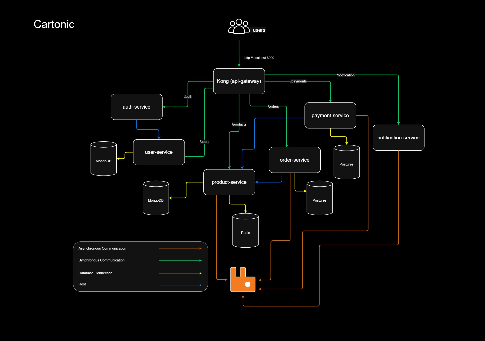

# 🛒 Cartonic - Microservices E-commerce App

Cartonic adalah proyek dummy e-commerce modern yang dibangun dengan arsitektur **microservices** menggunakan **Node.js**, **TypeScript**, dan **Express**, serta diorkestrasi dengan **Docker** dan **Kong API Gateway**.

---

## 📂 Tabel Konten

- [🛒 Cartonic - Microservices E-commerce App](#🛒-cartonic---microservices-e-commerce-app)
- [🚀 Fitur Utama](#🚀-fitur-utama)
- [📑 Architecture Diagram](#📑-architecture-diagram)
- [🧾 Struktur Proyek](#🧾-struktur-proyek)
- [💻 Apa yang dibutuhkan?](#💻-apa-yang-dibutuhkan)
- [⚙️ Cara Menjalankan](#⚙️-cara-menjalankan)
- [🔌 Dokumentasi API](#🔌-dokumentasi-api)
- [📦 Teknologi yang Digunakan](#📦-teknologi-yang-digunakan)
- [🧪 Testing](#🧪-testing)
- [👨‍💻 Author](#👨‍💻-author)
- [📝 Lisensi](#📝-lisensi)

---

## 🚀 Fitur Utama

- 🔐 Login dan Register via `auth-service`
- 👤 Manajemen Profil User via `user-service`
- 📦 CRUD Produk via `product-service`
- 🛒 Pemesanan Produk via `order-service`
- 💰 Simulasi Pembayaran via `payment-service`
- 📨 Pengiriman Notifikasi via `notification-service`
- 📊 Monitoring dengan **Prometheus** dan **Grafana**
- 🔀 API Gateway dengan **Kong**

---

## 📑 Architecture Diagram



---

## 🧾 Struktur Proyek

```
CARTONIC/
├── api-gateway/         # Konfigurasi Kong
├── docker/              # Dockerfile dan docker-compose.yml
├── docs/                # Dokumentasi API
├── scripts/             # Script otomatisasi
├── services/            # Semua service
├── .gitignore
└── README.md
```

---

## 💻 Apa yang dibutuhkan?

##### 🐳 Docker

Jika belum memiliki Docker, Anda dapat menginstal Docker dengan cara mengikuti [dokumentasi resmi](https://docs.docker.com/get-docker/).

##### 🔧 Kong Deck

Jika belum memiliki Kong Deck, Anda dapat menginstal Kong Deck dengan cara mengikuti [dokumentasi resmi](https://github.com/Kong/deck?tab=readme-ov-file#installation).

---

## ⚙️ Cara Menjalankan

### 1. Clone Project

```bash
git clone https://github.com/faujiahmat/Cartonic-Microservices-E-commerce-App.git
cd cartonic
```

### 2. Setup Environment Variables

Buat file `.env` untuk setiap service:

```bash
cp services/auth-service/.env.example services/auth-service/.env
# Ulangi untuk service lain
```

### 3. Inisialisasi Database Postgres

#### order-service

```bash
cd ./services/order-service
npm run migrate
# Untuk mendeploy database
```

#### payment-service

```bash
cd ./services/payment-service
npm run migrate
# Untuk mendeploy database
```

### 4. Jalankan Semua Service, Kong Gateway, dan Monitoring

```bash
chmod +x ./scripts/start.sh
./scripts/start.sh
```

---

## 🔌 Dokumentasi API

Kong Gateway berjalan di:

🔗 **URL:** [http://localhost:8000](http://localhost:8000)  
🛠️ **Konfigurasi Route:** `api-gateway/kong/config/kong.yml`  
📄 **Dokumentasi Endpoint Lengkap:** [`docs/api.md`](docs/api.md)

> Semua request ke service (Auth, User, Product, dll) akan melalui gateway ini. Pastikan Kong sudah dikonfigurasi dengan benar dan service-service sudah terhubung.

---

## 📦 Teknologi yang Digunakan

- **Node.js** + **Express**
- **TypeScript**
- **PostgreSQL** / **MongoDB** / **Redis**
- **Docker** + **Docker Compose**
- **Kong API Gateway**
- **Prometheus** + **Grafana** (Monitoring)
- **Sentry** (Error Monitoring)
- **RabbitMQ** (Message Broker)

---

## 🧪 Testing

Unit test tersedia per service di folder `__test__/`.

Contoh menjalankan test:

```bash
cd services/user-service
npm run test
```

---

## 👨‍💻 Author

Ahmat Fauji Mrp  
📧 ahmatfaujimrp@gmail.com  
📍 Sumatera Utara, Indonesia

---

## 📝 Lisensi

MIT License © 2025
